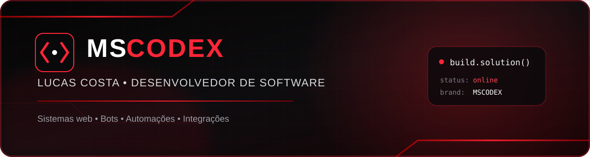

<div align="center">



<br>

### Transformo ideias em sistemas, sites e automações funcionais.

Desenvolvedor brasileiro e criador da **MSCODEX**, com foco em soluções digitais de visual forte, código organizado e aplicação prática.

[](https://github.com/LucasCosta01-code/mscodex)
[](https://www.linkedin.com/in/lucas-costa-b675762a7/)
[](mailto:tucasop@gmail.com)

</div>

---

## Sobre mim

```javascript
const lucas = {
  marca: "MSCODEX",
  foco: ["Sistemas Web", "Bots", "Automações", "Integrações"],
  tecnologias: ["JavaScript", "Node.js", "Python", "Java", "SQLite"],
  objetivo: "Criar soluções úteis, modernas e prontas para evoluir"
};
```

Gosto de construir projetos completos: da identidade visual e experiência do usuário até a lógica, banco de dados e implantação. Meu trabalho combina o estilo **preto e vermelho da MSCODEX** com soluções diretas para necessidades reais.

## O que eu desenvolvo

<table>
  <tr>
    <td width="50%" valign="top">
      <h3>🌐 Sistemas e sites</h3>
      Landing pages, portfólios, lojas, painéis administrativos e aplicações web responsivas.
    </td>
    <td width="50%" valign="top">
      <h3>🤖 Bots e automações</h3>
      Bots para Discord, fluxos automatizados, moderação, tickets, cadastros e relatórios.
    </td>
  </tr>
  <tr>
    <td width="50%" valign="top">
      <h3>🔌 APIs e integrações</h3>
      Integração entre plataformas, autenticação, bancos de dados e serviços externos.
    </td>
    <td width="50%" valign="top">
      <h3>🖥️ Software</h3>
      Aplicações desktop e ferramentas personalizadas em Java e Python.
    </td>
  </tr>
</table>

## Tecnologias

<div align="center">


</div>

## Projetos em destaque

<table>
  <tr>
    <td width="50%" valign="top">
      <h3><a href="https://github.com/LucasCosta01-code/mscodex">MSCODEX</a></h3>
      Site e loja da marca MSCODEX, com identidade neon preta e vermelha, área administrativa e integração com Supabase.
      <br><br>
      <code>HTML</code> <code>CSS</code> <code>JavaScript</code> <code>Supabase</code>
    </td>
    <td width="50%" valign="top">
      <h3><a href="https://github.com/LucasCosta01-code/paquist-oWeb">Paquistão Web</a></h3>
      Plataforma de gestão para Discord com bot modular, painel web, tickets, metas, moderação e banco SQLite.
      <br><br>
      <code>Python</code> <code>Node.js</code> <code>Discord</code> <code>SQLite</code>
    </td>
  </tr>
  <tr>
    <td width="50%" valign="top">
      <h3><a href="https://github.com/LucasCosta01-code/GeradorSenhaGUI-em-java">MSCODEX Vault</a></h3>
      Gerador de senhas desktop com <code>SecureRandom</code> e interface gráfica personalizada em preto e vermelho.
      <br><br>
      <code>Java</code> <code>Swing</code> <code>Java 2D</code>
    </td>
    <td width="50%" valign="top">
      <h3><a href="https://github.com/LucasCosta01-code/BlurSense-Detec-o-e-Desfoque-Inteligente">BlurSense</a></h3>
      Ferramenta em Python para detecção e desfoque inteligente, criada como experimento de visão computacional.
      <br><br>
      <code>Python</code> <code>Visão computacional</code>
    </td>
  </tr>
</table>

<div align="center">

[](https://github.com/LucasCosta01-code?tab=repositories)

</div>

## Atividade no GitHub

<div align="center">
  
  
</div>

## Vamos criar algo?

Se você precisa de um **site, sistema, bot ou automação**, entre em contato e conte sua ideia. Posso ajudar a transformar o projeto em uma solução clara, moderna e funcional.

<div align="center">

[](mailto:tucasop@gmail.com)

<br><br>

<sub>Desenvolvido com código, estratégia e identidade por <strong>MSCODEX</strong>.</sub>

</div>
